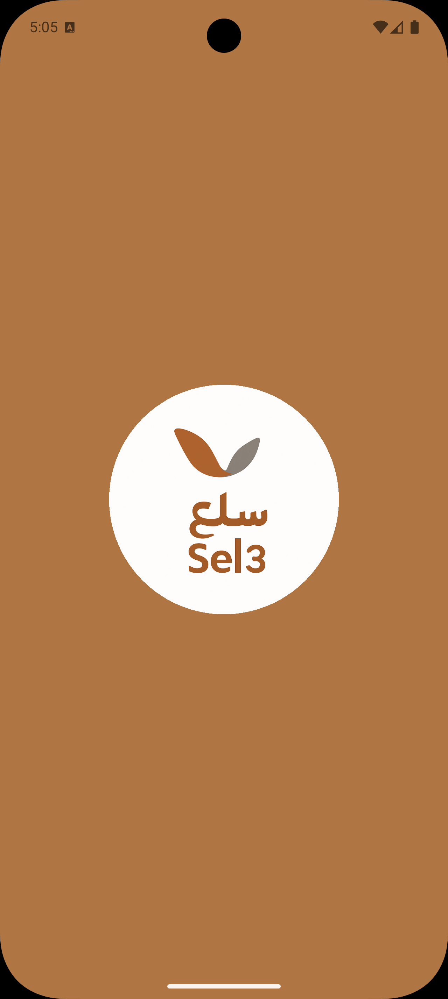

🛍️ Sel3

Sel3 is a modern marketplace app that allows users to buy and sell anything easily.
You can browse listings, create your own ads, and connect with others in a simple, intuitive interface.

🚀 Features

🧭 Browse Ads – Explore products and services posted by other users.

🏷️ Create Ads – Post your own listing with details and photos.

🔍 Search & Filter – Quickly find items based on category or price.

💬 Push Notifications – Stay updated when you receive messages or offers.

🌙 Modern UI – Smooth design with support for dark mode.

🌍 Full Arabic Language Support.

🧠 Tech Stack
🔹 Backend

Supabase

Auth – User authentication and Google sign-in.

Database – Manage users and ads.

Storage – Handle media uploads (images, etc.).

🔹 State Management

BLoC Pattern – Clean and scalable state management.

🔹 Dependency Injection

GetIt – Simple service locator for dependency management.

📦 Packages Used
* collection: ^1.1.0
* cached_network_image: ^3.4.1
* convex_bottom_bar: ^3.2.0
* cupertino_icons: ^1.0.8
* dartz: ^0.10.1
* device_preview: ^1.3.1
* dio: ^5.8.0+1
* equatable: ^2.0.7
* firebase_core: ^3.15.2
* firebase_messaging: ^15.2.10
* flutter:
  sdk: flutter
* flutter_animate: ^4.5.2
* flutter_bloc: ^9.1.1
* flutter_launcher_icons: ^0.14.4
* flutter_local_notifications: ^19.4.0
* flutter_localization: ^0.3.3
* flutter_localizations:
  sdk: flutter
* flutter_screenutil: ^5.9.3
* flutter_staggered_grid_view: ^0.7.0
* get_it: ^8.0.3
* go_router: ^16.0.0
* google_nav_bar: ^5.0.7
* google_sign_in: ^7.1.1
* http: ^1.4.0
* image_picker: ^1.1.2
* modal_progress_hud_nsn: ^0.5.1
* path: ^1.9.1
* path_provider: ^2.1.5
* pretty_dio_logger: ^1.4.0
* shared_preferences: ^2.5.3
* skeletonizer: ^2.1.0+1
* smooth_page_indicator: ^1.2.1
* supabase_flutter: ^2.9.1
* url_launcher: ^6.3.2

## Images
````
images
````
<div style= "display : flex ; justify-content: space-between ; margin : 20px 0px">



</div>


